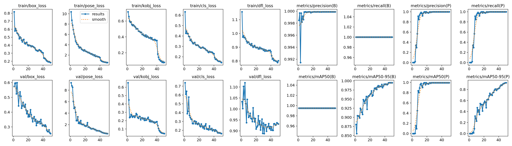
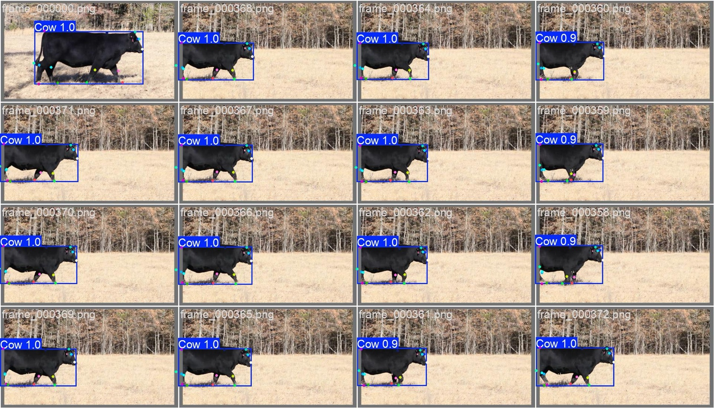
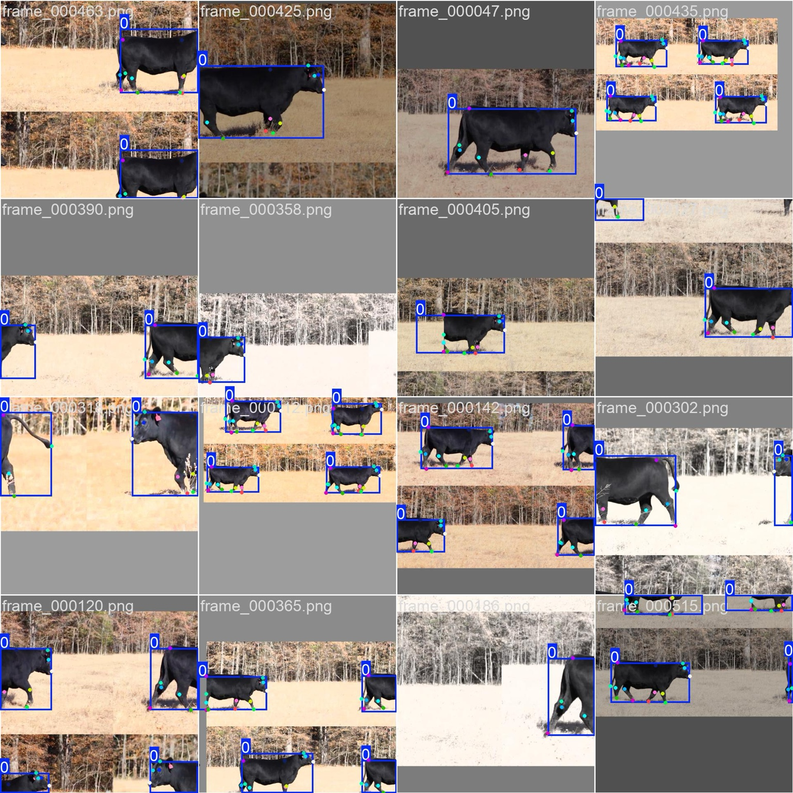
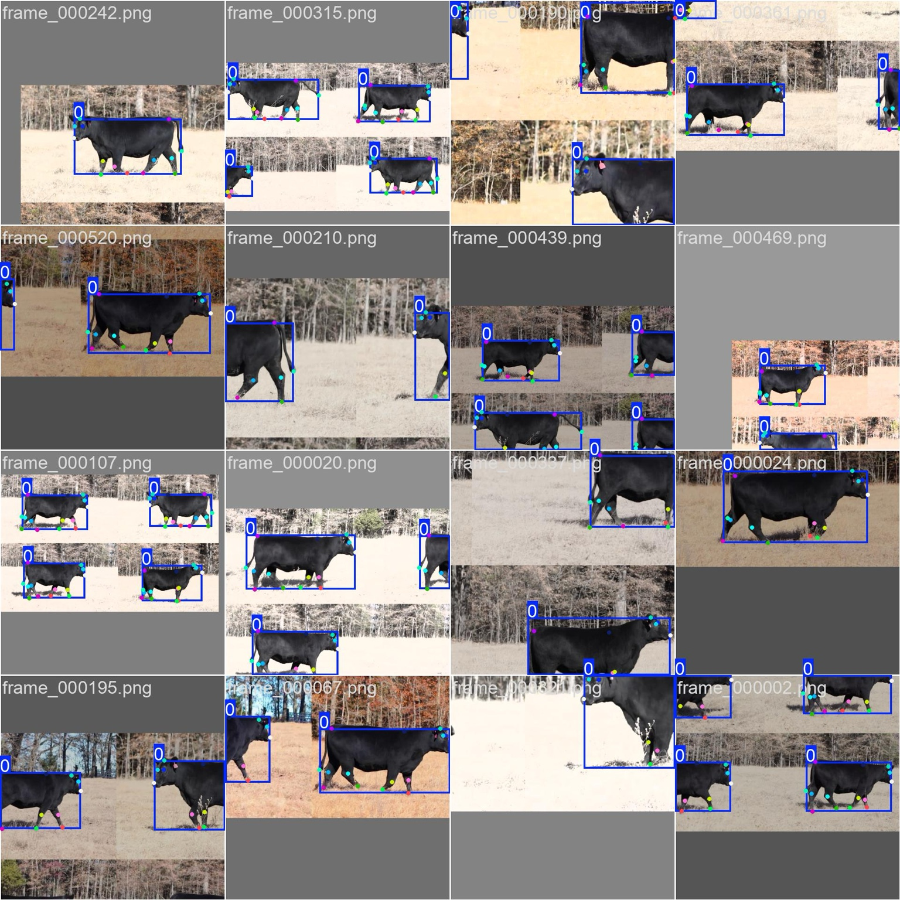
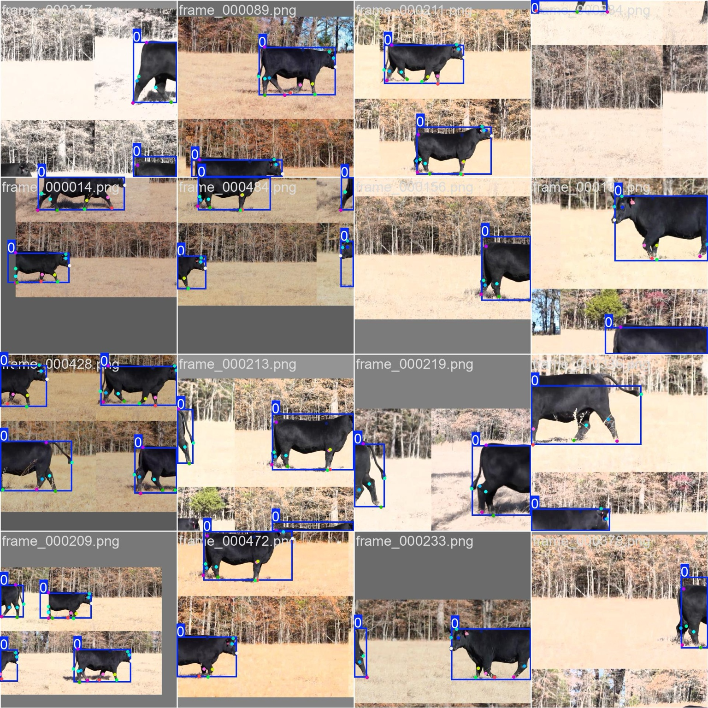
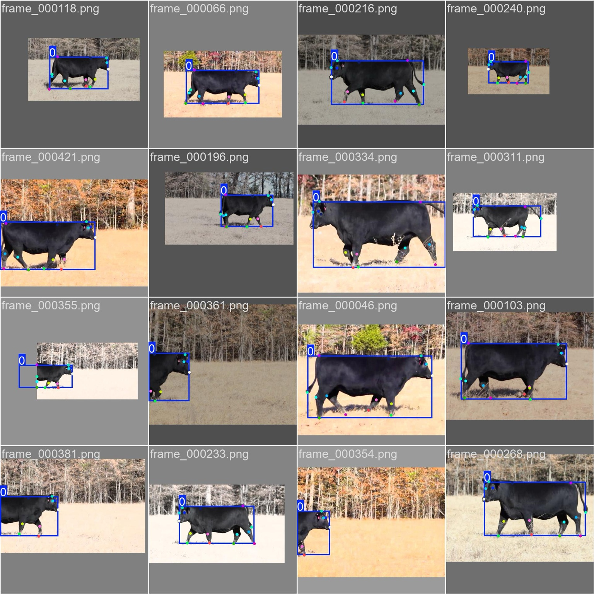
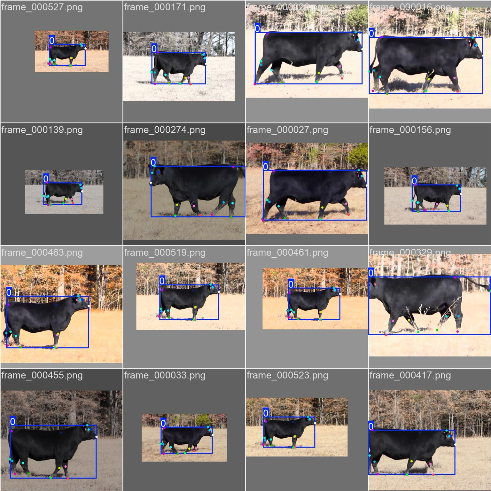
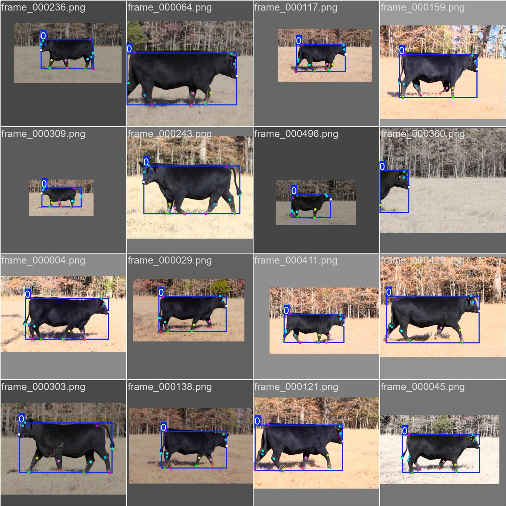

# 🐄 Cow Skeleton Pose Estimation with YOLOv8

Pose estimation model to detect cow skeletons in video frames using [YOLOv8-Pose](https://docs.ultralytics.com/tasks/pose/).  
Annotations were created with [CVAT](https://github.com/opencv/cvat) on 550 frames of a cow walking video.

---

## 📌 Project Overview

- **Dataset**: 550-frame video annotated with cow skeleton keypoints
- **Annotation Tool**: CVAT
- **Model**: YOLOv8n-pose
- **Training Framework**: Ultralytics YOLOv8
- **Use Case**: Detecting cow pose across frames (keypoint estimation)

---

## 📁 Directory Structure

\`\`\`
├── data/
│   ├── images/
│   └── labels/
├── train_cli/
│   ├── results.png
│   ├── val_batch0_pred.jpeg
│   └── ...
├── config.yaml
├── README.md
\`\`\`

---

## 🏁 Training

Training was performed using the following command:

\`\`\`bash
yolo pose train model=yolov8n-pose.pt data=config.yaml epochs=50 imgsz=640 device=mps name=train_cli
\`\`\`

---

## 📈 Results

### 📊 Training Metrics

  

### 🐄 Validation Predictions

  

---

## 🧪 Examples from Training

  
  
  

  
  
  

---

## 🔍 Inference

Run inference on a new video:

\`\`\`bash
yolo pose predict model=train_cli/weights/best.pt source=your_video.mp4
\`\`\`

Or on webcam:

\`\`\`bash
yolo pose predict model=train_cli/weights/best.pt source=0
\`\`\`

---

## 📖 Acknowledgements

- [Ultralytics YOLOv8](https://github.com/ultralytics/ultralytics)
- [CVAT Annotation Tool](https://github.com/opencv/cvat)
- Inspired by: [matterport/Mask_RCNN](https://github.com/matterport/Mask_RCNN)

---

## 📬 Contact

Feel free to reach out via [GitHub Issues](https://github.com/YOUR_USERNAME/YOUR_REPO/issues) for questions or feedback.
